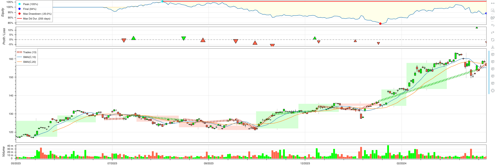

# Quant POC

## Installation (Mac)

```commandline
brew install ta-lib
pip install -r requirements.txt
```

## Usage
```commandline
python main.py --stock_id 0050.tw --period 1y --strategy SmaCross
```

The result plot will show in pop-up browser. Detail stats will show in logs.

Note: The value for `--strategy` is class name under `strategies` module

### Example Result
Browser


Logs
```
Start                     2023-05-02 00:00:00
End                       2024-05-02 00:00:00
Duration                    366 days 00:00:00
Exposure Time [%]                    81.22449
Equity Final [$]                141302.086471
Equity Peak [$]                 158223.164923
Return [%]                          -5.798609
Buy & Hold Return [%]               32.667798
Return (Ann.) [%]                   -5.959247
Volatility (Ann.) [%]                14.68263
Sharpe Ratio                              0.0
Sortino Ratio                             0.0
Calmar Ratio                              0.0
Max. Drawdown [%]                  -20.012144
Avg. Drawdown [%]                   -3.326296
Max. Drawdown Duration      255 days 00:00:00
Avg. Drawdown Duration       37 days 00:00:00
# Trades                                   13
Win Rate [%]                        30.769231
Best Trade [%]                      12.494644
Worst Trade [%]                     -6.020486
Avg. Trade [%]                      -0.458142
Max. Trade Duration          85 days 00:00:00
Avg. Trade Duration          24 days 00:00:00
Profit Factor                        0.778137
Expectancy [%]                      -0.370263
SQN                                 -0.403249
```
